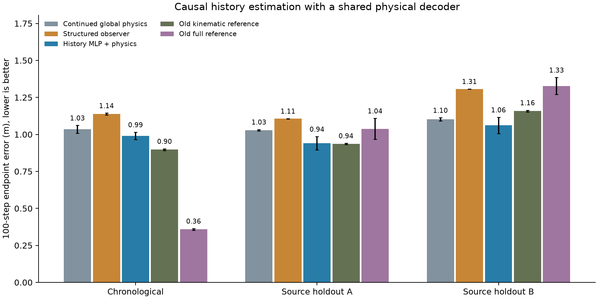

# 从过去观测估计当前响应，再进行物理预测：有限实验与审计

## 当前结论

已完成代码实现和全部 27 次拟合：三个划分 × 三个种子 × 三种方案。没有更换测试集、追加调参或删除不利结果。预先冻结的门槛结果为：mechanism=False；structure=False；performance=False。

历史 MLP 相对继续训练的全局物理模型，时间/A/B 的平均 E100 改善百分比分别为 4.3% / 8.5% / 3.7%；负值表示变差。完整数值如下。门槛是本轮继续研究的检查条件，不是期刊官方评分或接收概率。这轮不能独立解决创新性与外部验证问题。

**判断：本轮结构化观测器不值得按现有形式继续扩展。** 它在全部三个划分、每个种子上都比匹配训练预算的全局模型差。历史 MLP 有小幅改善，但时间划分 E100 仍约 0.990 m，远高于旧完整模型约 0.359 m；不能替换论文主模型。

更关键的是，事后历史干预并未证明过去状态变化的必要性。保持当前状态及真实过去动作不变，将历史速度/角速度全部重复为当前值后，MLP 在时间划分和 B 上反而略好，A 上几乎不变。因此“历史 MLP 比全局物理模型好”还可能来自当前状态相关的响应修正、额外非线性容量或与物理核心的共同补偿。

若继续，下一项必要检验是**重新训练的当前状态估计器与完整历史估计器的匹配对照**，让二者具有相同容量、物理递推和训练预算。当前测试时抹平干预不能代替这一步。只有完整历史持续优于当前状态对照，才值得扩大隐藏状态模型。本轮到此停止增加拟合，不继续在旧测试集上搜索。

## 1. 具体做了什么

预测时固定当前记录的速度与因果航向角速度，不声称已完成全部车辆状态的滤波重建。新增加的是两个有效响应状态 $b=(b_v,b_r)$，分别表示纵向加速度修正（m/s²）和航向角加速度修正（rad/s²）。它们不等于唯一可识别的外力或真实舵机状态。

估计器读取 15 个历史速度/角速度观测 $o_{t-14:t}$ 与 14 个过去动作 $u_{t-14:t-1}$，显式窗口约 0.64 秒；$r$ 本身由最多五个向后航向差分构成，所以原始航向依赖可能向前再延伸四帧，但仍不读取预测起点之后的数据。历史不会跨出原来划分的片段。网络不读取未来真实速度、航向、位置或图像。未来动作仍是原协议中已给定的记录动作。

结构化观测器先计算历史区间中的模型失配：

$$
e_i=\frac{o_{i+1}-o_i}{\Delta t}-f_{v,r}\!\left(\frac{o_i+o_{i+1}}{2},u_i\right).
$$

再递推两个响应状态：

$$
\rho=\exp(-\Delta t/\tau_b),\qquad
\hat b_{i+1}=\rho(1-K)\hat b_i+K\sqrt\rho\,e_i,
$$

其中 $0<K<1$、$\tau_b>0.05$ 秒，逐通道成立，初始响应为零。这是一个具体的加速度失配滤波假设；不宣称它是最优滤波器或准确的真实扰动重建。

进入未来预测后，不再接收观测：

$$
\dot v=f_v(v,u)+b_v,\qquad
\dot r=f_r(v,r,u)+b_r,\qquad
\dot b_j=-b_j/\tau_{b,j}.
$$

位置与航向仍按 $\dot x=v\cos\theta,\dot y=v\sin\theta,\dot\theta=r$ 积分。物理核心沿用上一轮八参数驱动、线性/二次阻力及转向响应模型；位姿没有神经残差。响应衰减解析计算，物理状态用中点积分。

道路继续保留为视觉模型提供的十个局部点，通过车辆位姿作刚体坐标变换。因此可以同时输出车辆状态和当前车身坐标系中的道路形状。这轮没有重训道路感知器、实现新道路重建或证明道路预测精度提升。

## 2. 为什么安排这三个对照

| 方案 | 初始响应如何得到 | 物理核心训练 | 用途 |
|---|---|---|---|
| global | 恒为零 | 从同一个旧物理权重继续训练 40 epoch | 排除额外训练预算的影响 |
| observer | 上述历史失配递推 | 相同起点、相同预算 | 检验结构化历史估计 |
| history_mlp | 58→32→2 的小型 MLP，输入同样的历史 | 相同起点、相同预算 | 检验结构化估计相对学习估计的价值 |

MLP 只产生两个初始响应坐标，未来仍由同一个物理模型递推。它不是重新训练一套任意位姿预测网络。MLP 隐层用 tanh，输出层初始为零，输入归一化只使用旧训练统计量。

注册参数数目分别为 12、12、1966；global 实际只使用八个核心参数，四个响应参数不参与预测；MLP 的两个观测器增益参数也不参与预测，所以实际有效参数数目是 1964。这不是参数量匹配实验，是历史信息和物理递推匹配的机制比较。

所有方案从每个划分/种子对应的同一个旧物理权重开始，统一 Adam 学习率 0.003、40 epoch 余弦调度、梯度裁剪 1、批量 128、训练 32 步、验证/测试 100 步；使用同一损失和同一批次随机顺序。每种方案只按自身验证集 E100 选择权重。三个旧划分、三个种子全部保留，所有拟合完成后才进行测试集评估。

## 3. 全部主要结果

| 模型 | 时间划分 E100 | 跨来源 A | 跨来源 B |
|---|---:|---:|---:|
| 全局物理，继续训练 | 1.0347 ± 0.0264 | 1.0283 ± 0.0053 | 1.1020 ± 0.0110 |
| 结构化历史观测器 | 1.1381 ± 0.0063 | 1.1059 ± 0.0016 | 1.3070 ± 0.0008 |
| 历史 MLP＋物理递推 | 0.9905 ± 0.0247 | 0.9408 ± 0.0448 | 1.0610 ± 0.0549 |
| 旧标定运动学参考 | 0.8978 ± 0.0055 | 0.9362 ± 0.0045 | 1.1584 ± 0.0056 |
| 旧完整模型参考 | 0.3587 ± 0.0054 | 1.0384 ± 0.0704 | 1.3274 ± 0.0574 |

单位米；越小越好。± 是三个训练种子的样本标准差，不是跨环境置信区间。A 为第二条记录训练、第一条测试；B 相反。两个旧参考没有响应历史输入，也没有本轮额外训练，不能把相对它们的差异全部归因为估计器结构；主要机制比较是前三行。

预先冻结的机制门槛：结构化观测器在三个划分上都比继续训练的全局物理模型改善至少 10%，并且每个划分三个种子均改善。结构门槛：三个划分均不差于同历史 MLP。性能门槛：时间划分不超过旧完整模型误差的 110%，两个来源留出不差于旧标定运动学。该性能门槛针对 observer；MLP 结果全部报告，不能事后把它改称预先选定的主方法。

## 4. 历史响应是否真的起作用

| 划分 | 观测器 | 观测器修正清零 | 只用最后一次变化 | 历史 MLP | MLP 修正清零 |
|---|---:|---:|---:|---:|---:|
| temporal | 1.1381 | 1.0970 | 1.1039 | 0.9905 | 1.0823 |
| outer0 | 1.1059 | 1.0905 | 1.0927 | 0.9408 | 1.0710 |
| outer1 | 1.3070 | 1.1498 | 1.1767 | 1.0610 | 1.1066 |

清零是在同一个已训练模型上把初始响应改成零；last 是同一个观测器只处理最后一个历史区间。它们都没有重新训练，属于测试时干预，会改变输入分布，不能单独当作公平架构对照。尤其不能把清零后的退化全部说成历史本身的因果贡献；物理核心与估计器在训练中可能相互补偿。

- temporal/observer：两通道衰减时间常数的种子平均为 0.320 秒、0.290 秒。
- temporal/history_mlp：两通道衰减时间常数的种子平均为 0.487 秒、0.575 秒。
- outer0/observer：两通道衰减时间常数的种子平均为 0.342 秒、0.292 秒。
- outer0/history_mlp：两通道衰减时间常数的种子平均为 0.571 秒、0.489 秒。
- outer1/observer：两通道衰减时间常数的种子平均为 0.404 秒、0.377 秒。
- outer1/history_mlp：两通道衰减时间常数的种子平均为 0.530 秒、0.553 秒。

全部窗口的两个响应估计保存在 `estimated_responses.npz`。衰减时间长短与预测增益共同解释，不把响应幅值直接当成真实动力学参数。

### 事后历史输入干预

| 划分 | 模型 | 正常历史 | 抹平状态 | 状态与动作均抹平 | 打乱旧历史对 |
|---|---|---:|---:|---:|---:|
| temporal | observer | 1.1381 | 1.1379 | 1.1519 | 1.1164 |
| temporal | history_mlp | 0.9905 | 0.9663 | 1.0020 | 1.1106 |
| outer0 | observer | 1.1059 | 1.1027 | 1.1120 | 1.0951 |
| outer0 | history_mlp | 0.9408 | 0.9433 | 0.9348 | 0.9819 |
| outer1 | observer | 1.3070 | 1.3259 | 1.3653 | 1.2235 |
| outer1 | history_mlp | 1.0610 | 1.0378 | 1.0594 | 1.0727 |

保持预测起点状态、未来动作和历史最后一个状态不变。抹平状态只重复当前速度/角速度，保留真实过去动作；全部抹平同时重复最后一个可用的过去动作。打乱历史使用固定随机排列，同时排列 14 个旧状态/动作对，最后保留当前观测。三个干预都可能制造训练分布之外的序列，因此只能说明敏感性，不能断言历史无用或当前状态足够。

这项诊断是在看到主要测试结果后单独写入 `history_intervention_protocol.json`，随后统一运行全部模型/划分/种子，共 54 行评估，没有重新拟合，没有改变原门槛。打乱顺序导致 MLP 变差也不足以证明它学到了正确物理时序，因为该输入本身不自然。

## 5. 审计范围与物理解释

- 原始记录、预处理片段、修正标签、旧权重和归一化统计的哈希已核验。
- 历史输入切片经过未来修改检查：修改预测起点之后的状态、从起点开始的未来动作，历史输入和当前初始状态保持不变；未来动作输入确实随修改而变化。训练和推断均不把未来观测送进初始响应估计器。
- 初始响应为零时，递推逐项复现旧物理核心；观测器的零创新与单次创新响应通过解析公式检查。
- 27 个权重都核对了 40 个 epoch 的验证集最小值；全部指标由保存数组复算，每个权重另抽取 24 个测试窗口重算。
- 在每个权重的 24 个验证窗口上，将积分步长缩小八倍，最大位置差为 0.00166969 m。任意道路点的刚体往返误差小于 $10^{-12}$。这些检查确认数值实现，不证明预测正确或全局稳定。
- 全部测试与诊断中的最大负速度比例为 0.0000%。这只是当前样本统计，不是物理可行性保证。

对结构化滤波器，$q=\rho(1-K)\in(0,1)$。相同输入下两个初始滤波状态的差按 $q^n$ 衰减；若历史创新幅值不超过 $M$，从零初始化的 14 步估计满足

$$
|b_{14}|\leq K\sqrt\rho\,M\frac{1-q^{14}}{1-q}.
$$

已用全部已训练观测器在验证样本上核验。这个结论仅针对响应滤波器，不等于车辆闭环稳定，也不是新的控制定理。预测时 $ b(t)=b_0e^{-t/\tau_b}$ 明确限制了响应修正的持续方式，但仍可能存在全局参数与局部响应之间的解释歧义。

B 的训练油门仍是恒定值。增加历史不能凭空辨识没有激励的油门增益；该值仍取决于初始化/先验。这里学习的是有物理单位的有效响应，不宣称恢复了真实质量、轮胎刚度或舵机参数。

## 6. 创新性与论文判断

从历史输入输出估计初始状态已有直接先例，例如 [Beintema、Toth、Schoukens，L4DC 2021](https://proceedings.mlr.press/v144/beintema21a.html)。车辆辨识结合扰动观测也已有 [Oei、Sawodny，IFAC 2022](https://www.sciencedirect.com/science/article/pii/S2405896322026143)。本轮并非这些方法的完整复现；引用用于说明“历史估计＋物理递推”的框架本身不能直接作为原创贡献。

因此需要分开判断：历史是否有预测价值、结构化估计是否优于简单神经估计、性能是否足够、提出的方法相对已知工作有什么实质区别。一个门槛通过不能替代另外三个问题。两条旧记录上的探索性提升也不能改称独立泛化验证。

本轮只形成方法与证据报告，未修改投稿正文，不上调接收判断。所有不利实验保留。下一步应依据这轮全体结果选择值得深入的分支，不在同一测试集上无限搜索直到出现好看的数值。

## 7. 文件与复现

- 模型：`src/baselines/response_observer.py`
- 冻结实验：`scripts/run_response_observer.py`、`reports/response_observer/protocol.json`
- 独立审计：`scripts/audit_response_observer.py`、`independent_audit.json`
- 结果与诊断：`results.json`、`curves.npz`、`estimated_responses.npz`、`per_source_results.json`、`per_segment_results.json`、`validation_motion_errors.json`
- 事后历史干预：`scripts/diagnose_history_response.py`、`history_intervention_protocol.json`、`history_interventions.json`、`history_intervention_curves.npz`
- 原始训练记录及权重：`checkpoints/response_observer/<fold>_seed<seed>/`
- 报告生成：`scripts/report_response_observer.py`

图表与报告均来自上述输出；可提交本轮新增代码及报告，但尚未自动 commit/push。

---
模型名称：GPT-6（Codex）；当前上下文未提供可确认的更细型号标识。
