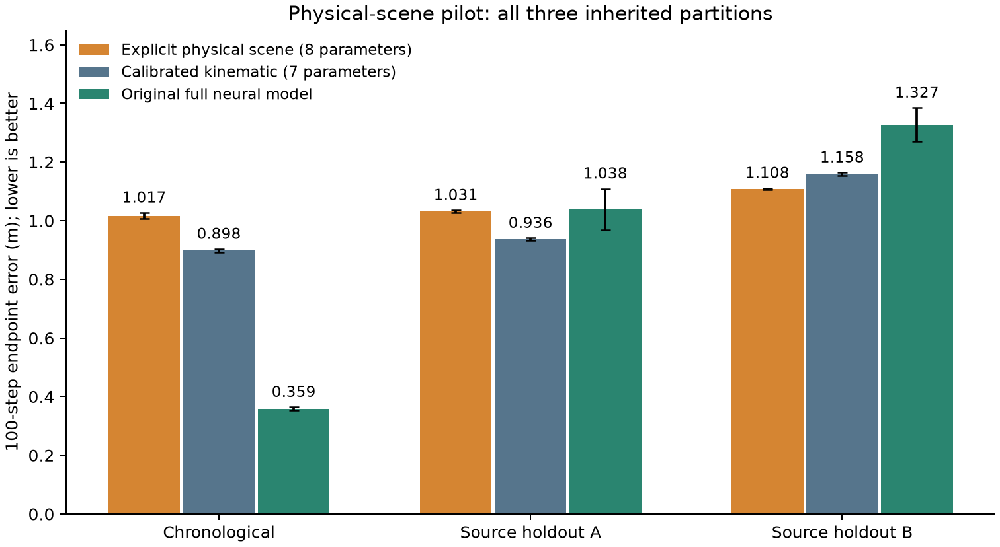

# 可解释车辆—道路模型重设计与首轮审计

可以更换原模型。应保留的目标是“明确描述车辆状态及赛道形状”，而不是守住原来的 Frenet 网络结构。本轮已经实现一个新候选，并完成 3 个划分 × 3 个种子、共 9 次训练。结论是：结构可用、解释明确，但性能没有通过预先固定的替代条件；暂不替换论文主模型，也不能据此把投稿判断提高到 weak accept。

## 1. 新模型到底描述什么

联合状态由车辆状态 $z=(x,y,\theta,v,r)$ 与有限局部道路点集 $\mathcal P=\{P_i\}_{i=0}^{9}$ 构成。位置单位为米，朝向为弧度，速度为米/秒，航向角速度为弧度/秒。道路点继续来自已训练视觉编码器，不声称本轮改善了视觉感知。十个点可以组成局部折线；这次实现返回点集，不声称已经实现连续曲线投影、全局闭合赛道重建或未观测道路补全。

车辆动力学为

$$
\dot x=v\cos\theta,\quad \dot y=v\sin\theta,\quad \dot\theta=r,
$$

$$
\dot v=a(u_T-\bar u_T)+f_0-c_1v-c_2v|v|,
$$

$$
\dot r=\frac{v(g_1u_S+g_3u_S^3+b_\kappa)-r}{\tau}.
$$

八个可训练系数是 $a,f_0,c_1,c_2,g_1,g_3,b_\kappa,\tau$；其中六个正系数采用 softplus，$\tau>0.05$ 秒。$\bar u_T$ 只从训练数据计算。使用显式中点积分，步长 1/22 秒；没有神经位姿修正、没有用训练分位数截断速度增量。这里的 $r$ 响应综合了转向执行与车体响应，并不等于直接测得的舵机时间常数。

在驱动力为零时，阻力对 $v^2/2$ 的导数贡献为 $-c_1v^2-c_2|v|^3\leq0$；给定固定速度与转向指令，航向角速度按一阶方程趋向目标。这些是局部机制解释，不是任意输入下的全局稳定性保证。当前模型忽略独立侧向速度，不适合直接宣称能描述高速漂移。

道路固定在初始坐标系中，车辆运动后通过

$$
P_i^{\mathrm{body}}(t)=R(\theta_t)^\top(P_i^{\mathrm{initial}}-p_t)
$$

更新当前车辆看到的道路形状。道路弯曲本身不产生转向力；当前假设下，转向响应由转向指令驱动。道路仍是联合状态中的显式几何对象，可供后续控制或路线约束读取。此实现中道路不改善车辆动力学预测，因此不能把“联合表示”说成已经验证了道路预测增益。

初始道路坐标到车身坐标的转换仍依赖特权初始横向偏差和航向误差；预测仍使用已记录未来动作。不是端到端纯摄像头自主驾驶，也未做闭环试车。

## 2. 已完成的有限实验

所有拟合均为 40 个 epoch；训练 32 步，验证和测试 100 步；同样的损失、窗口、验证集最小 E100 选模、Adam、余弦调度和梯度裁剪。学习率 0.01，与既有标定运动学相同。复用原来的两个对照权重，未对它们重新调参。所有 9 次拟合完成后才评估测试集。协议在本轮训练前冻结，但这些记录已被反复研究，不能称为独立确认。

| 划分 | 模型 | E25 | E50 | E100 | ADE |
|---|---|---:|---:|---:|---:|
| temporal | physical_scene | 0.1970 ± 0.0014 | 0.4980 ± 0.0049 | 1.0169 ± 0.0103 | 0.4997 ± 0.0051 |
| temporal | kinematic | 0.1803 ± 0.0016 | 0.4332 ± 0.0048 | 0.8978 ± 0.0055 | 0.4372 ± 0.0039 |
| temporal | guarded_full | 0.1301 ± 0.0032 | 0.1958 ± 0.0033 | 0.3587 ± 0.0054 | 0.2004 ± 0.0026 |
| outer0 | physical_scene | 0.1973 ± 0.0007 | 0.5071 ± 0.0023 | 1.0310 ± 0.0049 | 0.5045 ± 0.0023 |
| outer0 | kinematic | 0.1756 ± 0.0007 | 0.4552 ± 0.0014 | 0.9362 ± 0.0045 | 0.4548 ± 0.0015 |
| outer0 | guarded_full | 0.1740 ± 0.0073 | 0.4185 ± 0.0339 | 1.0384 ± 0.0704 | 0.4692 ± 0.0291 |
| outer1 | physical_scene | 0.2695 ± 0.0003 | 0.5706 ± 0.0007 | 1.1080 ± 0.0025 | 0.5633 ± 0.0009 |
| outer1 | kinematic | 0.2851 ± 0.0005 | 0.6084 ± 0.0012 | 1.1584 ± 0.0056 | 0.5951 ± 0.0016 |
| outer1 | guarded_full | 0.2817 ± 0.0155 | 0.5983 ± 0.0124 | 1.3274 ± 0.0574 | 0.6234 ± 0.0098 |

E100 为约 4.55 秒后的末端位置误差，单位米；± 为三次训练的样本标准差。A 在第二条记录训练、第一条测试；B 相反。窗口重叠、来源只有两个，种子误差条不能代表跨环境不确定性。

预先固定的替代门槛是：时间划分不差于原完整模型，A、B 均不差于标定运动学。新候选只通过 B，整体不通过。不能只保留 B 的改善来宣称新模型全面更好。这个试验也只否定“本结构在本训练预算下已经够用”，不证明所有物理模型都无效，或该模型已达最优。

## 3. 严格审计发现

- 代码和协议指纹、原始记录、预处理片段、修正标签、输入权重均已核验；9 个最终权重均来自各自验证集最小值，所有报告指标从保存数组复算；每个新权重另外重算 24 个测试窗口。
- 道路刚体变换的双精度往返误差在 $10^{-12}$ 以下；所有测试窗口也检查了变换一致性。固定车辆初始状态和动作、改变道路输入，车辆预测保持相同。
- 每个权重在 24 个验证窗口上用八倍细积分复核，当前积分与细积分的最大位置差小于 0.00049 m。因此这些抽查不支持把约米级误差归因于积分步长。没有观察到负预测速度或非有限输出；这不是任意状态下的安全证明。
- B 的训练油门完全恒定，纵向设计矩阵秩为 3，而不是 4；油门增益的梯度严格为零，三个种子都保留初始增益约 1.6。B 上的小幅改善不能被解释为成功辨识了油门外推响应。
- 八个系数只能叫有效响应参数。没有轮角、横向速度和足够输入激励，就不能把它们包装成真实轮胎刚度、真实轴距或经过测量确认的舵机参数。

## 4. 为什么没有马上改成更复杂的轮胎模型

在时间划分训练集上，单帧相邻位置与区间内记录速度/航向的梯形积分之间，等效速度向量差的 RMSE 为 0.277 m/s；在 0.5 秒区间上降为 0.071 m/s。此前初步的约 0.31 m/s 是另一统计量：单帧位移速度大小与区间起点记录速度之差；两者定义不同，不能混用。

用未来真实速度和真实航向积分，训练窗口的 100 步位置重建误差约 0.103 m。这是使用未来真值的诊断，绝不能作为可用预测模型或性能下界报告。它提示位姿积分关系仍有价值，当前运动响应预测还有改进空间；同时不能据此排除侧向运动、日志噪声或时间对齐问题。

复杂轮胎模型增加质量、转动惯量、前后轮刚度、摩擦等参数，会增加现有记录难以约束的自由度。因此本轮先测试少参数结构，而没有给参数起物理名称后就声称它们被辨识。

## 5. 创新性边界及后续取舍

“物理骨架 + 学习修正”已有大量研究，不能作为新的核心贡献。例如 [DKMGP（L4DC 2025）](https://proceedings.mlr.press/v283/ning25a.html)研究赛车动力学的多任务、多步学习修正；其平台与速度范围不同，这里只用来界定相关工作，未声称已公平复现实验。

转向执行动态的识别也不是新概念，见 [Rödönyi 等，SYSID 2021](https://arxiv.org/abs/2105.04529)。物理模型叠加学习分量后参数解释可能被破坏，已有 [Györök 等，L4DC 2025](https://proceedings.mlr.press/v283/gyorok25a.html)专门研究正交投影正则。不能简单加一个残差网络，再把这一组合说成原创。

我的建议是保留“显式车辆状态 + 显式道路形状 + 坐标变换一致性”作为研究框架，但本轮八参数实现只保留为基线。原完整模型保留为已有性能参考。下一轮若继续，应优先检验**因果状态估计和受约束的响应修正**：只使用预测起点之前的观测与动作估计当前响应状态，未来递推仍用显式动力学。若使用额外历史，所有相关基线必须获得同样历史，不能把信息增加误当作结构优势。

这仍是待验证的研究假设，不是已经实现的新结果。进一步的贡献必须具体落实为可检查的估计或约束方法，并通过消融证明价值；仅更换坐标系、添加侧滑变量、改叫世界模型都不够。恒定油门下无法识别输入增益这一限制需要显式承认，不能通过持续调参消除。

## 6. 可追溯文件

- 模型：`src/baselines/physical_scene.py`
- 冻结实验：`scripts/run_physical_scene.py`；`reports/physical_scene/protocol.json`
- 独立审计：`scripts/audit_physical_scene.py`
- 全部结果：`reports/physical_scene/results.json`、`curves.npz`、`per_source_results.json`
- 审计：`audit.json`、`training_identifiability.json`、`observation_consistency.json`、`numerical_and_identifiability_audit.json`
- 权重与训练历史：`checkpoints/physical_scene/<fold>_seed<seed>/`
- 自动门槛判定：`reports/physical_scene/decision.json`

本轮未修改论文正文/PDF，没有删除旧模型、旧记录或不利结果。完成后可将新增代码与报告做一次 Git commit；尚未自动提交。

---
模型名称：GPT-6（Codex）；当前上下文未提供可确认的更细型号标识。
