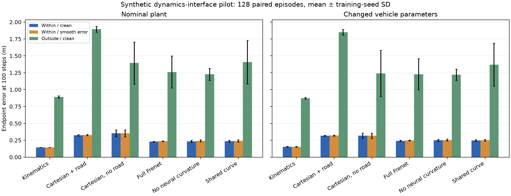

# 有限仿真机制实验：是否值得深入

日期：2026-09-28。**冻结判据结果：MECHANISM_ONLY（仅支持机制判断），GO=false。** 本轮不启动下一轮结构搜索。

**判断：当前证据不支持继续扩展“屏蔽曲率／共享曲线”这两条结构路线；它支持将动作范围外推作为更具体的后续研究问题。尚未得到可支持 weak accept 的新方法。**

## 1. 实验做了什么

- 6 类模型 × 3 个训练种子，共 **18 次从零训练**，每次 40 epochs。384 个训练场景、128 个验证场景；仅验证 E100 选权重。没有新增 CNN 或真实车辆记录。
- 测试为另一生成种子的 128 个场景，与训练、验证场景参数无重复；2 套车辆参数 × 2 个动作范围 × 3 个道路扰动级别，全部 **216 个模型／种子／条件结果**保留。
- 同一测试场景在各条件间配对：改变油门范围时保持初始状态、道路和转向不变；改变道路扰动时保持动作与真实轨迹完全不变；改变车辆参数时保持动作及初始状态不变。
- 真值使用独立的七状态平面动力学：侧向速度、饱和轮胎力、转向执行器滞后与二次阻力，RK4 每帧 16 子步。被测模型仍为五状态递推，包含模型失配。参数是透明的示例设定，**不是经过标定的 DonkeyCar，也不是 CommonRoad 的复现或高保真车辆保证**。
- 道路先于轨迹生成；车辆动力学方程不读取道路。转向命令与道路曲率相关，但道路不会直接改变轮胎力。完整未来动作按原任务供应给所有预测器，仍是离线动作条件预测。
- 这是动力学／道路接口实验，没有渲染相机图像或评估视觉编码器。独立生成不等于外部独立复现，更不等于真实新赛道验证。

模型层次设计参考了 [CommonRoad 作者的车辆模型说明](https://commonroad.in.tum.de/static/media/LA17.8f9d9dc3.pdf)：运动学单轨与考虑滑移的动力学单轨有不同假设。本轮方程、参数及实现由本项目单独定义，没有采用其发布分数或声称实现等价。

## 2. 全部条件的主要结果

E100 单位 m；± 是三个训练种子的样本标准差。它不是不同真实环境的不确定度。

### nominal

| 模型 | 范围内／无误差 | 范围内／轻扰动 | 范围内／较强扰动 | 范围外／无误差 | 范围外／轻扰动 | 范围外／较强扰动 |
|---|---:|---:|---:|---:|---:|---:|
| Kinematics | 0.143 ± 0.000 | 0.143 ± 0.000 | 0.143 ± 0.000 | 0.892 ± 0.018 | 0.892 ± 0.018 | 0.892 ± 0.018 |
| Cartesian + road | 0.323 ± 0.011 | 0.324 ± 0.010 | 0.328 ± 0.010 | 1.894 ± 0.043 | 1.895 ± 0.043 | 1.899 ± 0.043 |
| Cartesian, no road | 0.354 ± 0.051 | 0.354 ± 0.051 | 0.354 ± 0.051 | 1.394 ± 0.311 | 1.394 ± 0.311 | 1.394 ± 0.311 |
| Full Frenet | 0.230 ± 0.005 | 0.231 ± 0.005 | 0.236 ± 0.005 | 1.261 ± 0.238 | 1.261 ± 0.238 | 1.264 ± 0.238 |
| No neural curvature | 0.235 ± 0.016 | 0.236 ± 0.015 | 0.241 ± 0.015 | 1.226 ± 0.089 | 1.226 ± 0.089 | 1.230 ± 0.086 |
| Shared curve | 0.236 ± 0.014 | 0.237 ± 0.014 | 0.242 ± 0.016 | 1.406 ± 0.320 | 1.406 ± 0.320 | 1.408 ± 0.319 |

### shifted

| 模型 | 范围内／无误差 | 范围内／轻扰动 | 范围内／较强扰动 | 范围外／无误差 | 范围外／轻扰动 | 范围外／较强扰动 |
|---|---:|---:|---:|---:|---:|---:|
| Kinematics | 0.154 ± 0.005 | 0.154 ± 0.005 | 0.154 ± 0.005 | 0.873 ± 0.012 | 0.873 ± 0.012 | 0.873 ± 0.012 |
| Cartesian + road | 0.316 ± 0.009 | 0.317 ± 0.009 | 0.320 ± 0.008 | 1.848 ± 0.042 | 1.849 ± 0.042 | 1.853 ± 0.042 |
| Cartesian, no road | 0.319 ± 0.039 | 0.319 ± 0.039 | 0.319 ± 0.039 | 1.240 ± 0.343 | 1.240 ± 0.343 | 1.240 ± 0.343 |
| Full Frenet | 0.242 ± 0.007 | 0.242 ± 0.007 | 0.246 ± 0.006 | 1.228 ± 0.230 | 1.228 ± 0.230 | 1.231 ± 0.229 |
| No neural curvature | 0.250 ± 0.014 | 0.250 ± 0.014 | 0.255 ± 0.014 | 1.221 ± 0.083 | 1.222 ± 0.083 | 1.226 ± 0.080 |
| Shared curve | 0.246 ± 0.013 | 0.246 ± 0.013 | 0.251 ± 0.012 | 1.369 ± 0.318 | 1.369 ± 0.317 | 1.371 ± 0.316 |

## 3. 按事先固定的门槛判断

GO 要求预列候选在同一目标情景中，对两套车辆参数都比 full 降低至少 20% 的 E100，三个配对模型种子均改善、配对场景 bootstrap 改善区间下界为正；同时干净范围内代价不超过 10%，且目标误差不能比最强简单对照高出超过 10%。这些是本次研究决策门槛，不是 RAS 审稿标准。

两个候选（不向学习分支输入曲率、共享曲线）× 两个目标（范围内较强道路扰动、范围外无道路误差），**四项判断全部未通过**。没有根据结果选择不同阈值、提高噪声、增加种子或重新训练。

| full 的配对条件变化 | nominal 平均增量与条件 bootstrap 95% 区间（m） | shifted 平均增量与区间（m） | 是否通过预定机制门槛 |
|---|---:|---:|---|
| 范围内：较强道路误差 − 无误差 | 0.005 [0.000, 0.011] | 0.004 [-0.002, 0.010] | 否 |
| 无道路误差：范围外 − 范围内 | 1.030 [0.974, 1.080] | 0.986 [0.930, 1.036] | 是 |

区间以三个模型种子平均后的场景配对差做 2000 次 bootstrap，只描述本生成分布下的探索性不确定度；没有校正多重候选比较，不能当作真实环境的确证性检验。

## 4. 结论及解释边界

**本仿真网格内，动作范围变化的误差增量远大于预设平滑道路扰动；简单运动学模型在所有这些条件的平均 E100 都优于所比较的神经模型。** 两套车辆参数下方向一致，不是一个训练种子的偶然胜负。它支持研究动作外推，未支持当前两种结构改法。

但这轮不能推出“真实道路感知不重要”：轻／较强扰动的道路坐标 RMSE 实际约为 0.00945/0.03780 m，曲率 RMSE 约为 0.00649/0.02601 m^-1；0.10 m 是形变函数的系数，不是道路 RMSE。扰动经过共同曲线构造并保持初始位置和切向，因此未覆盖真实独立预测头的不一致、初始状态错误或更大的曲率误差。

改变油门会使速度和行驶距离变化，属于动作干预的后果。范围外 100 步真值端点超出 4.5 m 预览半径的比例为 nominal 75.0%、shifted 80.5%，所以最终动作效应不能全部解释成纯车辆响应网络失配。模型预览外推与内部状态监测均保留；没有丢弃这些场景。

## 5. 补充诊断：限幅的适用范围

以下为结果出来后的描述性核查，**没有用于改变冻结门槛**：神经模型两种单步运动增量的训练限幅均约 0.01。范围外真值速度增量超过该限幅的比例，nominal 为 21.94%，shifted 为 21.73%；范围内仅约 0.031%。这指出训练分位数限幅不能自动解释为物理硬件极限。

该现象只说明部分真实变化超出了当前神经更新的表示范围，不能证明它解释全部端点误差。没有此限幅的运动学基线也在范围外变差。初始执行器状态、未观测侧向运动、窄动作覆盖和长时误差累积同样存在；本轮没有逐项因果分解。

若下一轮获得授权，值得预先检验的单一假设是：**将可外推的车辆响应与受限学习残差分开，并使保护范围依据明确的物理条件定义，能否在保留范围内精度的同时改善动作外推？** 这只是后续假设，不能列为当前已经提出并验证的新方法。直接放宽限幅或增加一个门控，也不能预先视为创新。

## 6. 审计与交付

- 18 份选中权重的验证误差、40-epoch 最小值和参数量复核；216 条结果每条重算 24 个固定场景，指标从逐场景数组重新汇总，均通过。
- 重算确认道路盲模型对三个道路扰动等级输出逐位相同；地图缓冲区篡改不改变 Frenet 预测。生成器镜像、直行、圆弧与步长精度核验通过。
- 仿真数据、参数、协议、源码指纹、训练历史、权重、全部情景误差和判定保存在 `reports/synthetic_mechanism/` 与 `checkpoints/synthetic_mechanism/`。训练只访问训练／验证数据，测试生成在全部拟合完成后执行。
- 当前 40 页论文及其 3/5、Major Revision 评审保持不变。本轮没有足够依据提高到 weak accept，也未把试验性仿真自动混入真实车辆结果。
- 本轮有限实验到此结束，无下一轮训练、后台任务、投稿或推送。建议审阅后 commit，并单独备份被 Git 忽略的权重。

模型名称：GPT-6（Codex）；当前会话未提供更细型号标识。
