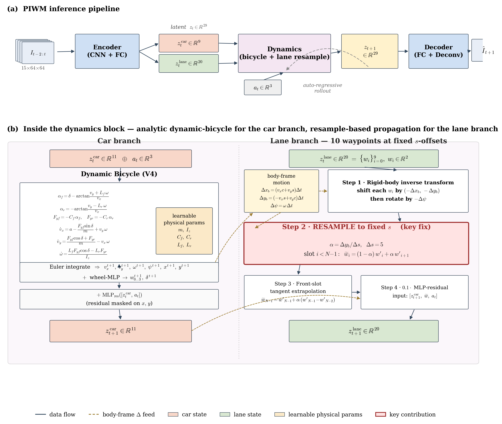
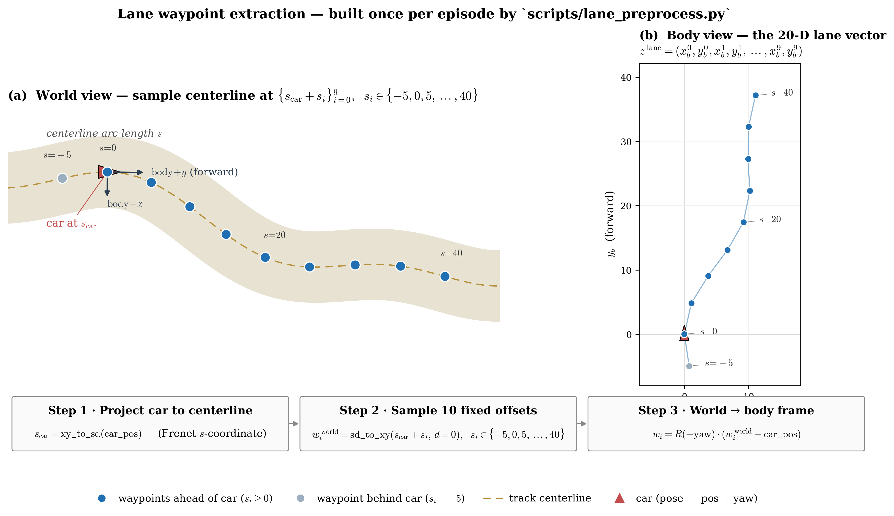

# PIWM — Physics-Informed World Model for Image-Controlled Racing Car

Image-to-future-image prediction for the `CarRacing-v0` DQN-controlled racing car, built on top of the [`hsai-predictor`](https://github.com/hsai-lab/hsai-predictor) dataset. The encoder lifts stacked frames to physical state, a **differentiable physics dynamics model** propagates the state forward, and a decoder renders the predicted frame. Progressive releases (v1 → v6) move from a black-box MLP to a resample-based lane-augmented bicycle model.



**Lane input.** The 20-D lane vector that the encoder is supervised against (and that the dynamics block propagates) is built once per episode by `scripts/lane_preprocess.py`. For every frame the car is projected onto the track centerline, ten waypoints are sampled at fixed arc-length offsets `s ∈ {-5, 0, 5, …, 40}`, and they are transformed into the car's body frame:



> Both figures are regenerated by `python reports/draw_architecture.py` and `python reports/draw_waypoints.py` (matplotlib only, vector PDFs also written).

## Pipeline

```
frames_{t-2..t} ──► Encoder ──► physical state s_t ──► Dynamics(s_t, a_t) ──► s_{t+1} ──► Decoder ──► image_{t+1}
                                     │                         ▲
                                     └── lane waypoints ───────┘  (v5, v6)
```

- **State** 11-D: `[x, y, yaw, vx, vy, ω, w0, w1, w2, w3, steer]`
- **Encoder target** 9-D (`x, y` integrated by dynamics)
- **Lane augment** (v5/v6) 20-D: 10 waypoints × (x, y) sampled at fixed s-offsets

## Repository layout

Top-level library modules stay at the root; every runnable script lives in a topic subfolder.

```
piwm/
├── config.py                # device, paths, normalization stats, hparams
├── utils.py                 # checkpoint + normalization helpers
├── track_utils.py           # CarRacing track geometry
├── lane_utils.py            # lane waypoint sampling + stats
├── relative_coords.py       # relative-pose frame conversion
│
├── data/dataset.py          # RacingCarDataset (autoencoder / dynamics modes)
│
├── models/                  # encoders, decoders, dynamics (v1..v6), localization
│   ├── encoder{,_lane}.py,  decoder{,_lane}.py
│   ├── dynamics.py                 # v1 MLP
│   ├── dynamics_bicycle{,_v2,_v3,_v4}.py   # v2..v4 bicycle ablations
│   ├── dynamics_lane_v5.py         # + lane waypoints (rigid-body propagate)
│   ├── dynamics_lane_v6.py         # + resample-based lane propagation
│   ├── localization*.py            # frame→(x,y) variants
│   ├── baseline.py,  piwm_v3.py
│
├── baselines/               # external baselines (same interface)
│   ├── dvbf.py, goku.py, vid2param.py
│   ├── sindyc{,_lane}.py
│   └── shared_dynamics{,_lane}.py  # shared-backbone fair-comparison wrappers
│
├── train/                   # every train_*.py
│   ├── train_autoencoder.py        # Phase 1: AE + physics supervision
│   ├── train_dynamics.py           # Phase 2: single-step
│   ├── train_dynamics_multistep.py # Phase 2: k-step rollout
│   ├── train_localization*.py      # (x,y) heads (MLP / LSTM / +action / SD)
│   ├── train_piwm_rel.py           # v2-rel (relative coords)
│   ├── train_piwm_bicycle{,_ablation}.py   # v2/v3/v4 bicycle
│   ├── train_piwm_lane_v5.py       # 3-stage lane (AE → dyn → E2E)
│   ├── train_piwm_lane_v6.py       # resample-based (reuses v5 AE)
│   ├── train_piwm_{e2e,v3}.py
│   ├── train_baseline.py
│   └── train_shared_baselines{,_lane}.py
│
├── eval/                    # compare_*, plot_*, evaluate_by_time
│   ├── compare_all_with_v5.py      # main multi-model comparison
│   ├── compare_baselines_rel.py
│   ├── compare_{all_shared,all_variants,bicycle_ablation,v5}.py
│   ├── compare_{final_state,image}_mse.py
│   ├── evaluate_by_time.py
│   └── plot_{lane_only,v4_framework,v6_highlight,v6_vs_lane_baselines}.py
│
├── viz/                     # visualize_*, animate_* (qualitative)
│   ├── visualize_{coarse,decoder,image_mse,rmse_curve,rmse_30steps}.py
│   ├── visualize_{pipeline_100steps,pipeline_final,rollout}.py
│   └── animate_{state_tracking,rolling_prediction,pipeline_rolling,pipeline_kalman}.py
│
├── reports/                 # PDF report generation (reportlab)
│   └── make_report_{pdf,v2}.py
│
└── scripts/                 # one-off / shell helpers
    ├── lane_preprocess.py          # offline lane feature extraction
    └── run_pipeline_after_baselines.sh
```

**Running scripts** — invoke from the repo root with the folder prefix, e.g.:

```bash
python train/train_piwm_lane_v6.py
python eval/compare_all_with_v5.py
python reports/make_report_v2.py
```

Each script in a subfolder begins with a small `sys.path` shim that inserts the repo root, so imports like `from config import DEVICE` and `from models.encoder_lane import …` resolve regardless of `cwd`.

## Version history (dynamics)

| Tag | Model | Key idea |
|-----|-------|----------|
| v1  | `dynamics.py` MLP | pure black-box residual |
| v2  | `dynamics_bicycle.py` | analytical bicycle + learned residual |
| v3  | `dynamics_bicycle_v3.py` | drops tire slip angle |
| v4  | `dynamics_bicycle_v4.py` | full model (used in later lane variants) |
| v5  | `dynamics_lane_v5.py` | + 20-D lane waypoints, rigid-body body-frame transform |
| v6  | `dynamics_lane_v6.py` | + resample to fixed s-offset (fixes v5 semantic drift) |

## Data

Data is **not** included. It is generated via the upstream project:

- Repo: [andywu0913/OpenAI-GYM-CarRacing-DQN](https://github.com/andywu0913/OpenAI-GYM-CarRacing-DQN) (controller) + [hsai-lab/hsai-predictor](https://github.com/hsai-lab/hsai-predictor) (collection pipeline)
- Expected path (see `config.py`): `../hsai-predictor-main/hsai-predictor-main/RacingCar/data/train/controller_5/*.npz`
- Each `.npz`: `imgs, position, yaw, velocity, angular_velocity, wheel_omega, steering_angle, action`

Normalization statistics (`PHYSICS_MEAN/STD`, `PHYSICS_MEAN_REL/STD_REL`) are already computed and hard-coded in `config.py` (≈85K frames, controller_5).

## Usage

```bash
# Stage 1 — autoencoder
python train/train_autoencoder.py

# Stage 2+3 — lane-augmented v6 (reuses v5 AE checkpoint)
python train/train_piwm_lane_v5.py   # produces checkpoints/piwm_lane_v5/ae.tar
python train/train_piwm_lane_v6.py   # produces checkpoints/piwm_lane_v6/{dyn,best}.tar

# Baselines (shared backbone, fair comparison)
python train/train_shared_baselines_lane.py

# Compare everything + build the PDF
python eval/compare_all_with_v5.py
python reports/make_report_v2.py     # writes report_v2_{cn,en}.pdf
```

Hyperparameters live in `config.py` and at the top of each `train_*.py`.

## Requirements

PyTorch, NumPy, matplotlib, tqdm, reportlab (PDF), Pillow. No `requirements.txt` is shipped — use the same environment as `hsai-predictor` (`conda env piwm`).

## Notes

- `checkpoints/`, `*.log`, `vis/`, and report PDFs are excluded from version control (see `.gitignore`). Re-generate them by re-running the training / comparison scripts.
- `USE_RELATIVE = True` (config.py) switches normalization to pose-relative coordinates — the default from v2-rel onwards.
